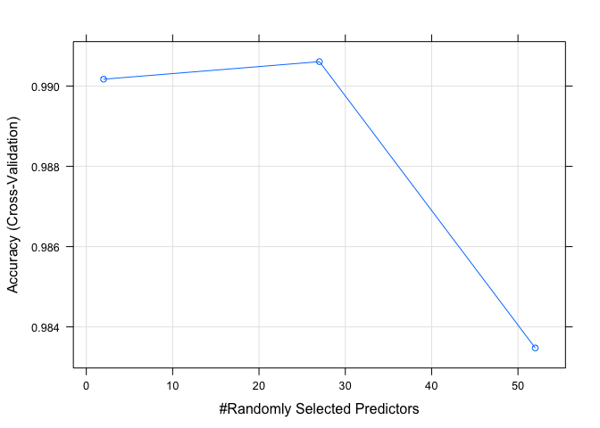

## Synopsis

This document builds a classification model based on the Weight Lifting Exercise dataset as detailed in the background section below. A total of 5 classes were present in the dataset, i.e. factor with 5 levels. The dataset was imputed and further preprocessed before segmenting into training (70%) and validation (30%) sets. A random forest approach with 6-fold cross validation was employed to build a classifcation model. The final random forest model used 2 variables for splitting at each tree node (mtry = 2) with 99.06% accuracy. Using the model to predict the validation set yielded an accuracy of 99.1% with 0.87% out of sample error. The result was satisfactory and was used to predict the test set with 20 observations. 

## Background: Practical Machine Learning Course Project

Using devices such as Jawbone Up, Nike FuelBand, and Fitbit it is now possible to collect a large amount of data about personal activity relatively inexpensively. These type of devices are part of the quantified self movement – a group of enthusiasts who take measurements about themselves regularly to improve their health, to find patterns in their behavior, or because they are tech geeks. One thing that people regularly do is quantify how much of a particular activity they do, but they rarely quantify how well they do it. In this project, your goal will be to use data from accelerometers on the belt, forearm, arm, and dumbell of 6 participants. They were asked to perform barbell lifts correctly and incorrectly in 5 different ways. More information is available from the website here: [link](http://web.archive.org/web/20161224072740/http:/groupware.les.inf.puc-rio.br/har (see the section on the Weight Lifting Exercise Dataset).

## Loading and preprocessing the data

Firstly, download the training and test datasets. Read the datasets into a tibble. Both the <span style="color: red;">*dplyr*</span>, <span style="color: red;">*lubridate*</span>, and <span style="color: red;">*caret*</span> packages are loaded behind the scenes. 

There are 19622 observations and 160 variables in the training dataset and 20 observations and 160 variables in the test dataset.

There are also 5 classes in the *classe* variable, namely: exactly according to the specification (Class A), throwing the elbows to the front (Class B), lifting the dumbbell only halfway (Class C), lowering the dumbbell only halfway (Class D) and throwing the hips to the front (Class E).

Out of the 19622 observations, there are only 406 complete cases. Hence, some cleaning is required to remove missing values.


```r
# download file
if(!file.exists("pml-training.csv")) 
    download.file("https://d396qusza40orc.cloudfront.net/predmachlearn/pml-training.csv","pml-training.csv")
if(!file.exists("pml-testing.csv")) 
    download.file("https://d396qusza40orc.cloudfront.net/predmachlearn/pml-testing.csv","pml-testing.csv")

# show dimensions
trngdataOrg <- tbl_df(read.csv("pml-training.csv")) 
dim(trngdataOrg)
```

```
## [1] 19622   160
```

```r
testdataOrg <- tbl_df(read.csv("pml-testing.csv")) 
dim(testdataOrg)
```

```
## [1]  20 160
```

```r
names(trngdataOrg) #All 160 Variables
```

```
##   [1] "X"                        "user_name"               
##   [3] "raw_timestamp_part_1"     "raw_timestamp_part_2"    
##   [5] "cvtd_timestamp"           "new_window"              
##   [7] "num_window"               "roll_belt"               
##   [9] "pitch_belt"               "yaw_belt"                
##  [11] "total_accel_belt"         "kurtosis_roll_belt"      
##  [13] "kurtosis_picth_belt"      "kurtosis_yaw_belt"       
##  [15] "skewness_roll_belt"       "skewness_roll_belt.1"    
##  [17] "skewness_yaw_belt"        "max_roll_belt"           
##  [19] "max_picth_belt"           "max_yaw_belt"            
##  [21] "min_roll_belt"            "min_pitch_belt"          
##  [23] "min_yaw_belt"             "amplitude_roll_belt"     
##  [25] "amplitude_pitch_belt"     "amplitude_yaw_belt"      
##  [27] "var_total_accel_belt"     "avg_roll_belt"           
##  [29] "stddev_roll_belt"         "var_roll_belt"           
##  [31] "avg_pitch_belt"           "stddev_pitch_belt"       
##  [33] "var_pitch_belt"           "avg_yaw_belt"            
##  [35] "stddev_yaw_belt"          "var_yaw_belt"            
##  [37] "gyros_belt_x"             "gyros_belt_y"            
##  [39] "gyros_belt_z"             "accel_belt_x"            
##  [41] "accel_belt_y"             "accel_belt_z"            
##  [43] "magnet_belt_x"            "magnet_belt_y"           
##  [45] "magnet_belt_z"            "roll_arm"                
##  [47] "pitch_arm"                "yaw_arm"                 
##  [49] "total_accel_arm"          "var_accel_arm"           
##  [51] "avg_roll_arm"             "stddev_roll_arm"         
##  [53] "var_roll_arm"             "avg_pitch_arm"           
##  [55] "stddev_pitch_arm"         "var_pitch_arm"           
##  [57] "avg_yaw_arm"              "stddev_yaw_arm"          
##  [59] "var_yaw_arm"              "gyros_arm_x"             
##  [61] "gyros_arm_y"              "gyros_arm_z"             
##  [63] "accel_arm_x"              "accel_arm_y"             
##  [65] "accel_arm_z"              "magnet_arm_x"            
##  [67] "magnet_arm_y"             "magnet_arm_z"            
##  [69] "kurtosis_roll_arm"        "kurtosis_picth_arm"      
##  [71] "kurtosis_yaw_arm"         "skewness_roll_arm"       
##  [73] "skewness_pitch_arm"       "skewness_yaw_arm"        
##  [75] "max_roll_arm"             "max_picth_arm"           
##  [77] "max_yaw_arm"              "min_roll_arm"            
##  [79] "min_pitch_arm"            "min_yaw_arm"             
##  [81] "amplitude_roll_arm"       "amplitude_pitch_arm"     
##  [83] "amplitude_yaw_arm"        "roll_dumbbell"           
##  [85] "pitch_dumbbell"           "yaw_dumbbell"            
##  [87] "kurtosis_roll_dumbbell"   "kurtosis_picth_dumbbell" 
##  [89] "kurtosis_yaw_dumbbell"    "skewness_roll_dumbbell"  
##  [91] "skewness_pitch_dumbbell"  "skewness_yaw_dumbbell"   
##  [93] "max_roll_dumbbell"        "max_picth_dumbbell"      
##  [95] "max_yaw_dumbbell"         "min_roll_dumbbell"       
##  [97] "min_pitch_dumbbell"       "min_yaw_dumbbell"        
##  [99] "amplitude_roll_dumbbell"  "amplitude_pitch_dumbbell"
## [101] "amplitude_yaw_dumbbell"   "total_accel_dumbbell"    
## [103] "var_accel_dumbbell"       "avg_roll_dumbbell"       
## [105] "stddev_roll_dumbbell"     "var_roll_dumbbell"       
## [107] "avg_pitch_dumbbell"       "stddev_pitch_dumbbell"   
## [109] "var_pitch_dumbbell"       "avg_yaw_dumbbell"        
## [111] "stddev_yaw_dumbbell"      "var_yaw_dumbbell"        
## [113] "gyros_dumbbell_x"         "gyros_dumbbell_y"        
## [115] "gyros_dumbbell_z"         "accel_dumbbell_x"        
## [117] "accel_dumbbell_y"         "accel_dumbbell_z"        
## [119] "magnet_dumbbell_x"        "magnet_dumbbell_y"       
## [121] "magnet_dumbbell_z"        "roll_forearm"            
## [123] "pitch_forearm"            "yaw_forearm"             
## [125] "kurtosis_roll_forearm"    "kurtosis_picth_forearm"  
## [127] "kurtosis_yaw_forearm"     "skewness_roll_forearm"   
## [129] "skewness_pitch_forearm"   "skewness_yaw_forearm"    
## [131] "max_roll_forearm"         "max_picth_forearm"       
## [133] "max_yaw_forearm"          "min_roll_forearm"        
## [135] "min_pitch_forearm"        "min_yaw_forearm"         
## [137] "amplitude_roll_forearm"   "amplitude_pitch_forearm" 
## [139] "amplitude_yaw_forearm"    "total_accel_forearm"     
## [141] "var_accel_forearm"        "avg_roll_forearm"        
## [143] "stddev_roll_forearm"      "var_roll_forearm"        
## [145] "avg_pitch_forearm"        "stddev_pitch_forearm"    
## [147] "var_pitch_forearm"        "avg_yaw_forearm"         
## [149] "stddev_yaw_forearm"       "var_yaw_forearm"         
## [151] "gyros_forearm_x"          "gyros_forearm_y"         
## [153] "gyros_forearm_z"          "accel_forearm_x"         
## [155] "accel_forearm_y"          "accel_forearm_z"         
## [157] "magnet_forearm_x"         "magnet_forearm_y"        
## [159] "magnet_forearm_z"         "classe"
```

```r
unique(trngdataOrg$classe) #Number of classes
```

```
## [1] "A" "B" "C" "D" "E"
```

```r
ccases <- sum(complete.cases(trngdataOrg)) #number of complete cases
```

### Imputing data

The training data is subsetted to remove unnecessary variables or those with missing data. There are 67 variables that only contain non-NA values at 406 complete cases observations. These would be removed from the training dataset. It also appears that the first seven variables are not related to the data obatined from the sensors. Both the training and test dataset are subsetted such that both datasets contain the same set of 85 variables (except for the classe variable in the test dataset).


```r
#number of variables with NA values for all observations except the complete cases
sum(colSums(is.na(trngdataOrg))==19622-ccases) 
```

```
## [1] 67
```

```r
trngdata <- trngdataOrg[, -c(1:7)] #remove first 7 variables
testdata <- testdataOrg[, -c(1:7)] #remove first 7 variables

trngdata <- trngdata %>%
    select(which(colSums(is.na(.)) == 0))

subsettedVar <- names(trngdata)[1:85] #select all except classe variable

testdata <- testdata %>%
    select(subsettedVar) #subset test dataset to the same variable 
```

```
## Note: Using an external vector in selections is ambiguous.
## ℹ Use `all_of(subsettedVar)` instead of `subsettedVar` to silence this message.
## ℹ See <https://tidyselect.r-lib.org/reference/faq-external-vector.html>.
## This message is displayed once per session.
```

```r
#check if the variables in both datasets are the same
sum(names(trngdata) %in% names(testdata))
```

```
## [1] 85
```

### Near Zero Variance

In a further step, there are 33 variables with near zero variance, which would also be removed from the training and test sets. The resultant traning set would consist of 53 variables (52 in test set).


```r
nzvVec <- nearZeroVar(trngdata, saveMetrics=TRUE)$nzv

#nvariables with near zero variances
names(trngdata)[nzvVec]
```

```
##  [1] "kurtosis_roll_belt"      "kurtosis_picth_belt"    
##  [3] "kurtosis_yaw_belt"       "skewness_roll_belt"     
##  [5] "skewness_roll_belt.1"    "skewness_yaw_belt"      
##  [7] "max_yaw_belt"            "min_yaw_belt"           
##  [9] "amplitude_yaw_belt"      "kurtosis_roll_arm"      
## [11] "kurtosis_picth_arm"      "kurtosis_yaw_arm"       
## [13] "skewness_roll_arm"       "skewness_pitch_arm"     
## [15] "skewness_yaw_arm"        "kurtosis_roll_dumbbell" 
## [17] "kurtosis_picth_dumbbell" "kurtosis_yaw_dumbbell"  
## [19] "skewness_roll_dumbbell"  "skewness_pitch_dumbbell"
## [21] "skewness_yaw_dumbbell"   "max_yaw_dumbbell"       
## [23] "min_yaw_dumbbell"        "amplitude_yaw_dumbbell" 
## [25] "kurtosis_roll_forearm"   "kurtosis_picth_forearm" 
## [27] "kurtosis_yaw_forearm"    "skewness_roll_forearm"  
## [29] "skewness_pitch_forearm"  "skewness_yaw_forearm"   
## [31] "max_yaw_forearm"         "min_yaw_forearm"        
## [33] "amplitude_yaw_forearm"
```

```r
trngdata <- trngdata[, !nzvVec] #remove 33 nzv variables
testdata <- testdata[, !nzvVec[1:85]] #remove 33 nzv variables
```

### Data Segmentation

Since there is a final test set provided, we will first split the training dataset into pure training (70%) and a validation set (30%).


```r
set.seed(98754)
puretrng <- createDataPartition(trngdata$classe, p=0.70, list=FALSE)
pureTrngData <- trngdata[puretrng, ]
```

```
## Warning: The `i` argument of ``[`()` can't be a matrix as of tibble 3.0.0.
## Convert to a vector.
## This warning is displayed once every 8 hours.
## Call `lifecycle::last_warnings()` to see where this warning was generated.
```

```r
valData <- trngdata[-puretrng, ]
```

## Random forest approach

We start off with a random forest approach for this classification problem. Since the dataset is rather larger, we adopt a 6-fold cross validation approach with an assumption that the dataset is drawn from the same distribution. The final model used 2 variables for splitting at each tree node (mtry = 2) with 99.06% accuracy.


```r
cv <- trainControl(method="cv", 6) #cross validation
rfModel <- train(classe ~ ., data=pureTrngData, method="rf", trControl=cv, ntree=250)
rfModel$finalModel
```

```
## 
## Call:
##  randomForest(x = x, y = y, ntree = 250, mtry = param$mtry) 
##                Type of random forest: classification
##                      Number of trees: 250
## No. of variables tried at each split: 2
## 
##         OOB estimate of  error rate: 0.68%
## Confusion matrix:
##      A    B    C    D    E class.error
## A 3902    3    1    0    0 0.001024066
## B   18 2636    4    0    0 0.008276900
## C    0   18 2376    2    0 0.008347245
## D    0    0   38 2210    4 0.018650089
## E    0    1    2    3 2519 0.002376238
```

```r
plot(rfModel)
```

<!-- -->

### Validation

The validation set is used to validate the trained model "rfModel". It appears that the accuracy is 99.1% and the out of sample error is 0.87%.


```r
predictValRF <- predict(rfModel, newdata=valData)
confMatRF <- confusionMatrix(predictValRF, as.factor(valData$classe))
confMatRF
```

```
## Confusion Matrix and Statistics
## 
##           Reference
## Prediction    A    B    C    D    E
##          A 1673   12    0    0    0
##          B    0 1126   12    0    0
##          C    0    1 1013   28    1
##          D    0    0    1  936    3
##          E    1    0    0    0 1078
## 
## Overall Statistics
##                                           
##                Accuracy : 0.99            
##                  95% CI : (0.9871, 0.9924)
##     No Information Rate : 0.2845          
##     P-Value [Acc > NIR] : < 2.2e-16       
##                                           
##                   Kappa : 0.9873          
##                                           
##  Mcnemar's Test P-Value : NA              
## 
## Statistics by Class:
## 
##                      Class: A Class: B Class: C Class: D Class: E
## Sensitivity            0.9994   0.9886   0.9873   0.9710   0.9963
## Specificity            0.9972   0.9975   0.9938   0.9992   0.9998
## Pos Pred Value         0.9929   0.9895   0.9712   0.9957   0.9991
## Neg Pred Value         0.9998   0.9973   0.9973   0.9943   0.9992
## Prevalence             0.2845   0.1935   0.1743   0.1638   0.1839
## Detection Rate         0.2843   0.1913   0.1721   0.1590   0.1832
## Detection Prevalence   0.2863   0.1934   0.1772   0.1597   0.1833
## Balanced Accuracy      0.9983   0.9930   0.9906   0.9851   0.9980
```

```r
#out of sample error
1-as.numeric(confMatRF$overall[1])
```

```
## [1] 0.01002549
```

### 20 Sample Test Set

Hence the 20 sample test set is predicted as follows.


```r
predictTestRF <- predict(rfModel, testdata)
predictTestRF
```

```
##  [1] B A B A A E D B A A B C B A E E A B B B
## Levels: A B C D E
```

